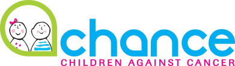
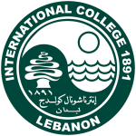

#### Volunteering 

#### Chance Association: Children against cancer (Nov 2017- Jun 2019)

##### *Student Volunteer*
- Sold products to raise funds for the association such as calendars with children's drawings, chocolate boxes and candies. 
- Paid regular visits to children suffering from cancer, supporting them with their studies and spending fun time with them ensuring by that both: beneficial and entertaining environment.
- Sorted and distributed Christmas gift boxes to less fortunate children, ensuring by that a Smile is drawn on every child's face, regardless the circumstances faced in Lebanon.
  

#### Internationnal College: Community Service (Sep 2018 - Jun 2019)

##### *Student Volunteer*
I strongly believe in our responsibility to pay our society back. Hence, I actively engaged in the school's Social Community Services, including but not limited to:
- Environment: During the Beirut Marathon, we collected plastic water bottles for recycling supporting by that "Green Glass" recycling initiative in Lebanon, while maintaining clean roads at all times.
- Social Services: On several occasions, we visited public schools to entertain kids of all ages. Activities revolved around theatre plays, games, etc.
- Children: To ensure all kids are given equal opportunity to cherish the Holidays' Season, I actively participated in the logistics of a Christmas party for children of less fortunate families, preparing and serving dinner, animation and gifts distribution
  

#### Extracurricular Activities
- Was part of the peer tutoring club in school tutoring over 50 of my peers.
- Was on the football and track and field team representing my school and country in many internationnal competitions.
- Part of the 1st team of my university's football team.
- Voted representative of the student council.
- Was Class delegate for 6 years.

